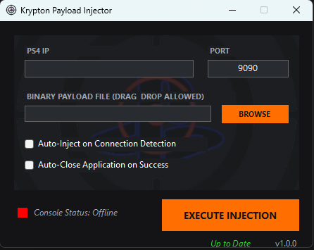

# 🟠 Krypton Payload Injector

A sleek, independent desktop network utility client designed for stable PS4 payload deployment. Built entirely from scratch with native low-overhead logic and a custom matte-dark interface layout.

## 🚀 Premium System Features
* **Real-Time Tracking:** Automated asynchronous background network threads scan and monitor console connection states every 3.5 seconds.
* **Smart Automation:** Optional hands-free toggles allow for immediate auto-injection the exact second your console hits the home network router.
* **Configuration Persistence:** Native memory registries securely store your last working network parameters so you never have to re-type settings.
* **Seamless Cloud Updates:** Integrated background updater mechanics dynamically communicate with secure delivery streams to push instant file enhancements.

## 🛠️ Quick Start Instructions
1. Download the latest independent standalone executable build from the official **[Releases]([https://github.com](https://github.com/thread1ng/Krypton-Updates/releases))** sidebar module.
2. Input your console's local network IP address within the configuration entry field.
3. Drag and drop your `.bin` payload file directly onto the dark window interface workspace canvas, or click **Browse**.
4. Confirm your target destination parameters and click **Execute Injection**.
